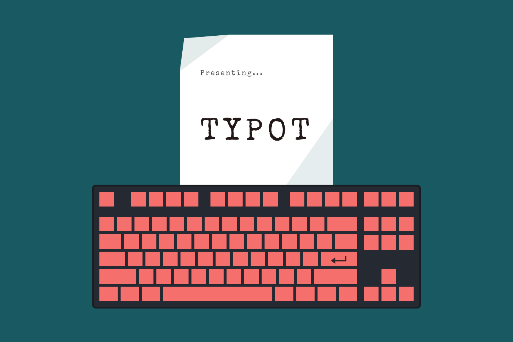

# TYPOT



Show off your **"real"** typing skills

## About

`typot` is a Typeracer bot written in Python

**DISCLAIMER**
`typot` is meant to be a 'flex tool', but not a cheating tool. So please use it only when racing your friends, that you know there is absolutely no chance of beating, or when you're having a bad day.

I don't take any responsibility whatsoever for your banned accounts. Through my course of testing, it seems like this bot is undetectable to a point e.g., approx. 300-350 wpm is the most it can possibly squeeze out before being detected (No human being can type consistently at this speed, let alone without making *any* mistakes). If you're not satisfied - tweak the numbers yourself.

Either way, enjoy!

## Usage

To start the program, simply type this command to the terminal

```bash
python[3] typot.py
```

When the website shows up, click `agree` when asked for cookies, and quickly choose your desired game mode. For now, this bot is not programmed to make any typos, so even an **INSTANT DEATH MODE** looks like a joke at this point - I suggest to try it out.